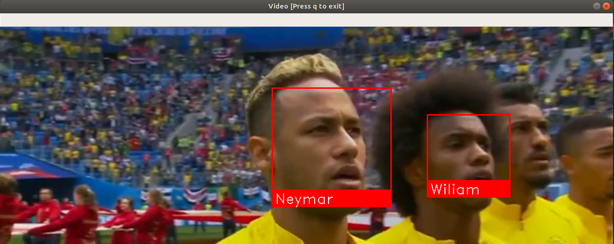

# Face Recognition

Simple python script for face recognition, downloading videos directly from YouTube.

# Requirements

* Python 3+
* Pip 


# Install

For MacOS

```
brew install cmake boost boost-python --with-python3 --without-python
```

```
pip3 install -r requirements.txt
```

# Running

```
python3 fr.py https://www.youtube.com/watch?v=lWvRf5ZbmZA faces/
```

# Output



Press q to exit.

Tested on Ubuntu 18.04 and MacOS High Sierra

# References

[Python Face Recognition](https://github.com/ageitgey/face_recognition)

[OpenCV](http://opencv-python-tutroals.readthedocs.io)